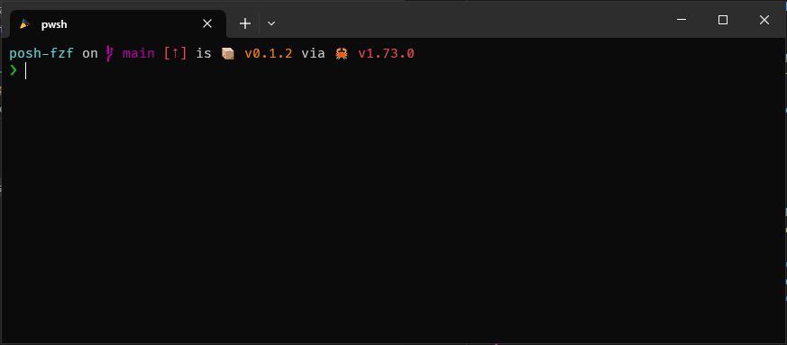

# posh-fzf
[](https://crates.io/crates/posh-fzf)
[](https://github.com/domsleee/posh-fzf/actions/workflows/ci.yml)

[Fzf](https://github.com/junegunn/fzf) keybinding integration with powershell 5.1 and pwsh >= 7.



## Installation

1. Run `cargo install posh-fzf`, or download the latest release from [releases](https://github.com/domsleee/posh-fzf/releases).
2. Install `fd` and `fzf`.
   * For windows, I would recommend installing [scoop](https://scoop.sh/), and running `scoop install fzf fd`.
3. Add this to `code $PROFILE`:
```powershell
Invoke-Expression (&posh-fzf init | Out-String)

# Customize the key bindings to your liking
Set-PSReadLineKeyHandler -Key 'Ctrl+t' -ScriptBlock { Invoke-PoshFzfSelectItems }
Set-PSReadLineKeyHandler -Key 'Alt+c' -ScriptBlock { Invoke-PoshFzfChangeDirectory }
Set-PSReadLineKeyHandler -Key 'Ctrl+r' -ScriptBlock { Invoke-PoshFzfSelectHistory }
```

## Built in commands
| Command                         | Description                                                                           |
| ------------------------------- | ------------------------------------------------------------------------------------- |
| `Invoke-PoshFzfSelectItems`     | Select one or more items and paste it to the terminal.                                |
| `Invoke-PoshFzfChangeDirectory` | Show all child directories, and if selected, `cd` to that directory.                  |
| `Invoke-PoshFzfSelectHistory`   | Show distinct historical commands in most recent order.                               |
| `Invoke-PoshFzfStartProcess`    | Invokes a process using the [Process API][ProcessAPI]. See custom commands below.     |
| `Invoke-PoshFzfInsertUtf8`      | Inserts text forcing UTF-8 encoding.                                                  |
| `Invoke-PoshFzfTempEnv`         | Temporarily set environment variables, and reset them after executing a script block. |

[ProcessAPI]: https://learn.microsoft.com/en-us/dotnet/api/system.diagnostics.process.start?view=net-7.0

## Custom commands

You can use any `fzf` command in keybindings by tweaking it to use the `Invoke-PoshFzf` cmdlet.

> [!NOTE]
> `-HeightRowsOrPercent` must match the `--height` argument of fzf. This is due to `fzf` and PSReadline not working well together if `fzf` has to scroll the terminal down when it is invoked.

For example, instead of `git branch | fzf`, you would have:

```powershell
Set-PSReadLineKeyHandler -Key 'Alt+b' -ScriptBlock { 
    $branch = git branch | Invoke-PoshFzfStartProcess -FileName "fzf" -Arguments @("--height=45%") -HeightRowsOrPercent "45%"
    if ($branch) {
        $branch = $branch.Replace("*", "").Trim()
        [Microsoft.PowerShell.PSConsoleReadLine]::DeleteLine()
        Invoke-PoshFzfInsertUtf8("git checkout '$branch'")
        [Microsoft.PowerShell.PSConsoleReadLine]::AcceptLine()
    }
}
```

You can also executables other than `fzf`.

For example, [zoxide](https://github.com/ajeetdsouza/zoxide) provides a way to inspect it's db using `zoxide query -i`. Internally, it calls `fzf`.  
Instead of `$selection = (zoxide query -i)`, it can be called like this:

```powershell
Set-PSReadLineKeyHandler -Key 'Ctrl+shift+z' -ScriptBlock {
    # 45% height comes from: https://github.com/ajeetdsouza/zoxide/blob/a624ceef54a31de2d0624e9eb14ce65024cc9e79/src/cmd/query.rs#L92
    $fzfSelection = Invoke-PoshFzfStartProcess -FileName "zoxide" -Arguments @("query", "-i") -HeightRowsOrPercent "45%"
    if ($fzfSelection) {
        [Microsoft.PowerShell.PSConsoleReadLine]::DeleteLine()
        Invoke-PoshFzfInsertUtf8("cd $fzfSelection")
        [Microsoft.PowerShell.PSConsoleReadLine]::AcceptLine()
    }
}
```

## Using fzf environment variables

You can set `FZF_DEFAULT_COMMAND` temporarily like this, the example is from [posh-fzf.ps1](./resource/posh-fzf.ps1)
```powershell
function Invoke-PoshFzfChangeDirectory {
    Invoke-PoshFzfTempEnv @{FZF_DEFAULT_COMMAND = 'fd --type d --hidden --exclude ".git"'} -ScriptBlock {
        $directory = Invoke-PoshFzfStartProcess -FileName "fzf" -Arguments @("$defaultHeightArg", "--preview", "fd . {} --maxdepth 1")
        if ($directory) {
            [Microsoft.PowerShell.PSConsoleReadLine]::DeleteLine()
            Invoke-PoshFzfInsertUtf8 "cd $directory"
            [Microsoft.PowerShell.PSConsoleReadLine]::AcceptLine()
        }
    }
}
```